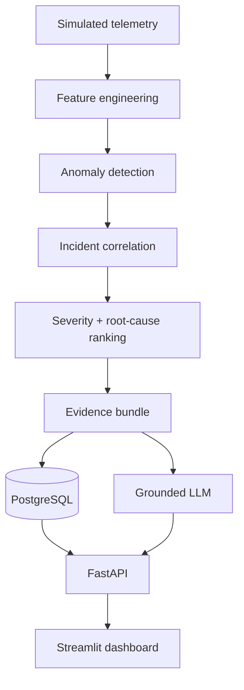

# Pulse — AI Fault Detection & Incident Intelligence System

An end-to-end incident-intelligence pipeline built on
simulated production telemetry, with an honestly-measured evaluation of
where it works and where it doesn't.

## Overview

Pulse simulates production-style service telemetry with injected faults
(latency spikes, memory leaks, config regressions, and more), detects
unusual behaviour in that telemetry, groups related anomalies into
incidents, ranks the most likely root cause for each incident, collects the
supporting evidence, and presents the whole investigation through a
dashboard — with an LLM used only to narrate the evidence already gathered,
never to decide anything.

It exists to demonstrate an ambiguous problem turned into a well-engineered,
honestly-measured Python system: every number below was produced by a
command you can re-run, and every limitation is stated rather than hidden.

## Demo


A real, completed `eval_fast` run, viewed through the Streamlit dashboard:
incident navigator on the left, selected incident's timeline, top-3 ranked
root causes, key evidence, and explanation together on one screen. No LLM
provider was configured for this screenshot, so the explanation shown is
Pulse's deterministic, evidence-only fallback — labelled as such in the UI,
not disguised as a model output.

## How It Works

```
fault → telemetry → anomaly detection → incident correlation
      → root-cause ranking → evidence → explanation
```

A scenario config injects one or more faults (e.g. a memory leak on one
service) into a simulated service topology. The simulator produces raw
per-service, per-metric time series. Feature engineering turns those into
rolling statistics with no look-ahead. Four detectors (a random floor, a
static threshold, a robust rolling z-score, and an IsolationForest) flag
anomalous points. Correlation groups related anomalies — across services and
time — into incidents. Root-cause ranking scores each incident's candidate
services against a heuristic signature. A bounded evidence bundle is
assembled from the incident's own facts, and an LLM (or a deterministic
template if none is configured) narrates it.

## Architecture



**The deterministic pipeline establishes the incident facts; the LLM is used
only to explain a bounded evidence bundle.** Detection, correlation,
severity and root-cause ranking are pure, seeded functions with no LLM
involvement (docs/architecture.md A4). The LLM never decides any of those —
it only narrates an already-persisted evidence bundle, and its output is
discarded unless it passes grounding validation (A5). FastAPI is the only
read/write surface; Streamlit is presentation only, reached exclusively over
HTTP (§2.1, mechanically checked by `tests/test_architecture.py`).

## Results

All numbers below are measured, not targets (see
[docs/evaluation.md](docs/evaluation.md) for full methodology, seed set, and
every target-vs-measured comparison). Reported over 5 independently-seeded
validation runs (`val.yaml`, eval seeds 2002-2006) unless stated otherwise.
**The held-out test seed has not been touched** — these are validation-seed
numbers, not final frozen-method numbers.

| Metric | Result | Command |
|---|---|---|
| Episode detection rate (B2 / M1, all 6 fault types) | **1.000 ± 0.000** | `python -m pulse.eval.multiseed` |
| Episode detection rate (B1) | 0.667 ± 0.000 — misses `config_regression`/`latency_injection` entirely on every seed | same |
| Incident alert-reduction factor (production correlator) | **27.79× ± 1.34** (14,947 anomalies → 538 incidents, mean) | same |
| Incident purity (IoU≥0.3) | 0.933 ± 0.149 | same |
| False incidents/hour | 5.575/hr — misses the ≤0.5/hr target | same |
| Root-cause top-1, **ORACLE mode** (correlation assumed perfect) | **0.933 ± 0.091** | same |
| Root-cause top-1, **end-to-end mode** (real pipeline, both stages) | **0.267 ± 0.365** | same |
| `(T_window, D_max)` sweep (single seed, 8 of 20 planned cells) | Widening `t_window` 60s→300s and `d_max` 1→4 both improve recall/false-incident-rate/alert-reduction with no purity cost on this seed | `python -m pulse.eval.sweep` |
| Feature engineering wall-clock (`val.yaml`, 12 services, 4 days) | 23.0s | `python -m pulse.bench.suite` |
| Scenario simulation wall-clock | 0.41s | same |

The 0.933 root-cause figure is measured in **ORACLE mode** — ranking is
scored against ground-truth incident membership, isolating the ranker's own
quality from correlation's. It is **not** an end-to-end accuracy number.
The real, end-to-end root-cause top-1 accuracy — running the actual
correlator and then the actual ranker in sequence — is **0.267 ± 0.365**.
The gap between the two (0.933 vs. 0.267) is attributable almost entirely to
incident correlation precision, not to root-cause ranking: **evaluation
identified incident correlation as the main end-to-end bottleneck**, not the
ranker.

## Tech Stack

- **Simulation & science core:** Python 3.11+, NumPy, pandas, scikit-learn
  (IsolationForest), PyYAML, PyArrow — pure, deterministic, no I/O
  (`pulse.core`).
- **Persistence:** PostgreSQL, SQLAlchemy, Alembic.
- **API:** FastAPI, Pydantic, Uvicorn.
- **Async execution:** Celery, Redis (broker only — no result backend; task
  outcomes live in Postgres).
- **AI explanation layer:** Anthropic Python SDK, with a evidence-grounding
  validator and a deterministic fallback (no external dependency required).
- **Dashboard:** Streamlit, Plotly.
- **Testing/tooling:** pytest, Hypothesis (property tests), ruff, mypy
  (`--strict`).

### Running the dashboard

With the API already up, start Streamlit:

```sh
.venv/bin/streamlit run src/pulse/dashboard/app.py
```

Opens on `http://localhost:8501`. One page: pick a run, pick one of its
incidents from a compact list, and see its timeline (metric selector,
anomaly markers, incident window highlighted), top-3 ranked root causes,
key evidence, and the AI explanation together on one screen — each evidence
item that names a metric can jump the timeline straight to it
(docs/product.md FR-10.3). Raw technical detail (evidence IDs, detector
names, lower-ranked candidates) stays available behind compact expanders
rather than crowding the primary view. Reads Pulse exclusively through
the running API (`pulse.dashboard.api_client`) — never the database
directly (docs/architecture.md §2.1). `PULSE_API_URL` overrides the API base
URL if it isn't on `http://localhost:8000`.
